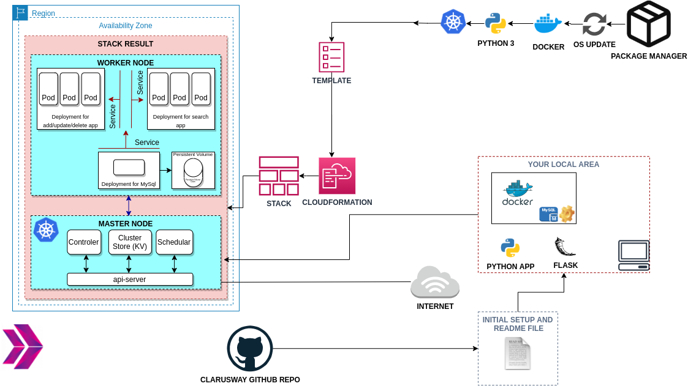

# Microservice Architecture for Phonebook Web Application (Python Flask) with MySQL using Kubernetes.

## Description

Phonebook Microservice Web Application creates a web application with MySQL Database using Docker and Kubernetes for the understanding of Microservice architecture. In this application, we have a frontend service and a backend service to interact with database service. Each service is managed by a Kubernetes deployment. The backend service is a gateway for the application and it serves the necessary web pages for create, delete and update operations while the frontend service serves a search page in order to conduct read operations. To preserve the data in the database, persistent volume and persistent volume claim concepts are adopted.

## Steps

- Step 1: Create your Kubernetes environment with Terraform.

- Step 2: Create Docker images and push to Docker Hub Repository.

- Step 3: Make K8s deployments.